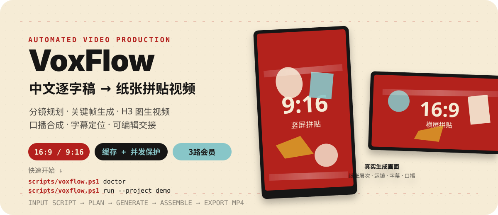
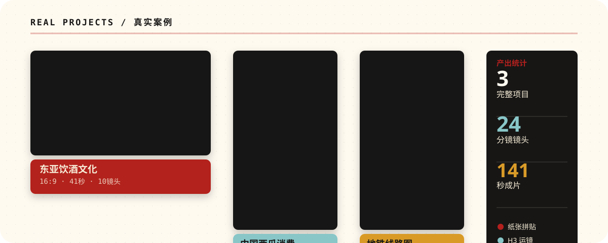
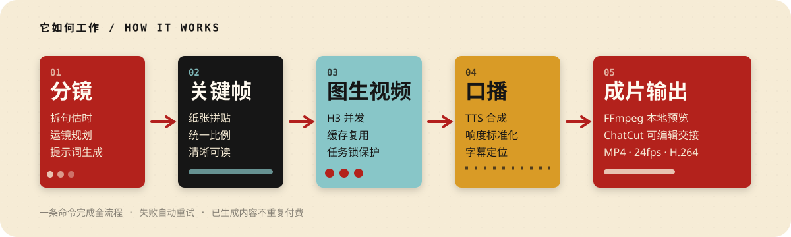
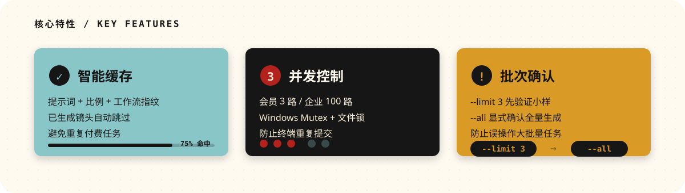

<p align="center">
  
</p>

<p align="center">
  <a href="https://github.com/shaomingchan/vox_video/actions/workflows/ci.yml"></a>
  <a href="https://github.com/shaomingchan/vox_video/blob/main/LICENSE"></a>
  <a href="https://www.python.org/"></a>
</p>

**VoxFlow** 是一套中文知识视频自动化生产工具：输入逐字稿，自动完成分镜规划、纸张拼贴关键帧生成、RunningHub H3 图生视频、TTS 口播、字幕定位，最终输出可编辑的成片或 ChatCut 交接文件。

适合需要**批量制作解释型短视频**的创作者、教育工作者和内容团队。

<br>

## 真实案例

<p align="center">
  
</p>

三个完整项目已验证全流程：

| 项目 | 格式 | 时长 | 镜头数 | 主题 |
|------|------|------|--------|------|
| 东亚饮酒文化 | 16:9 横屏 | 41秒 | 10 | 社会文化解释 |
| 中国西瓜消费 | 9:16 竖屏 | 94秒 | 13 | 数据可视化叙事 |
| 地铁线路图 | 9:16 竖屏 | 5.6秒 | 1 | 概念解释 |

成片包含：纸张拼贴构图 · H3 镜头运动 · 中文口播 · 底部居中字幕

<p align="center">
  <video src="https://raw.githubusercontent.com/shaomingchan/vox_video/main/assets/readme/demos/watermelon-demo.mp4" controls muted width="720"></video>
</p>

<p align="center">
  <sub>▲ 实拍 demo：《中国西瓜消费》16:9 横屏版（720p，含口播与字幕）·
  如内嵌播放不可用，<a href="https://github.com/shaomingchan/vox_video/blob/main/assets/readme/demos/watermelon-demo.mp4">点这里观看 ▶</a></sub>
</p>

<br>

## 它如何工作

<p align="center">
  
</p>

**一条命令，五个阶段**

```powershell
scripts/voxflow.ps1 run --project demo --script examples/demo-script.txt
```

1. **分镜规划** — 拆句估时，生成运镜和提示词
2. **关键帧生成** — 统一比例的纸张拼贴画面
3. **图生视频** — RunningHub H3 并发生成，带缓存和任务锁
4. **口播合成** — TTS + 响度标准化 + 字幕定位
5. **成片输出** — FFmpeg 本地 MP4 或 ChatCut 可编辑交接

失败自动重试，已生成内容不重复付费。

<br>

## 5 分钟快速开始

### 1. 安装

```powershell
git clone https://github.com/shaomingchan/vox_video.git
cd vox_video

py -3.11 -m venv .venv
.\.venv\Scripts\python.exe -m pip install --upgrade pip
.\.venv\Scripts\python.exe -m pip install -e .

Copy-Item config.example.toml config.local.toml
```

### 2. 配置外部依赖

编辑 `config.local.toml`：

```toml
[paths]
whiteboard_root = "D:/path/to/whiteboard"           # image2 和 TTS 适配器
vox_director_root = "C:/Users/you/.codex/skills/vox-director"
projects_root = "projects"

[assembly]
bgm = "D:/path/to/background-music.mp3"             # 背景音乐（可选）
```

设置 RunningHub API Key：

```powershell
$env:RUNNINGHUB_API_KEY = "<your-member-key>"
```

### 3. 健康检查

```powershell
scripts/voxflow.ps1 doctor
```

确认外部适配器、FFmpeg、RunningHub 连接状态。

### 4. 小批量验证（推荐）

```powershell
# 只生成 3 个镜头，先看效果
scripts/voxflow.ps1 run --project demo --script examples/demo-script.txt --limit 3

# 预览生成的视频片段
scripts/voxflow.ps1 preview --project demo --limit 3
```

`--limit 3` 是**成本检查点**：先验证画面比例、运动、口播和字幕是否符合预期，再决定是否生成完整批次。

### 5. 完整生成

确认小样无误后：

```powershell
scripts/voxflow.ps1 run --project demo --script examples/demo-script.txt --all
```

最终成片位于 `projects/demo/final/final_video.mp4`。

<br>

## 核心特性

<p align="center">
  
</p>

### 智能缓存

- 基于提示词、画面比例和工作流 ID 建立指纹
- 已成功生成的镜头自动跳过
- 避免重复付费任务

### 并发控制

- RunningHub 会员模式：3 路并发（代码级上限）
- 企业共享模式：1-100 路可配置并发
- Windows Mutex + Unix 文件锁，防止多终端重复提交

### 批次确认

- `--limit N` 先生成 N 个镜头验证效果
- `--all` 显式确认全量生成
- 防止缓存异常或误操作导致大批量任务

<br>

## 支持的格式和规范

### 画面比例

**横屏（16:9）** 或 **竖屏（9:16）**，在 `config.toml` 中设置：

```toml
[project]
aspect = "16:9"    # 或 "9:16"

[assembly]
width = 1920       # 横屏：1920×1080，竖屏：1080×1920
height = 1080
```

### 技术规范

- **分辨率**：默认继承 RunningHub 原始片段，避免无效放大和额外模糊
- **帧率**：固定 24 fps（CFR）
- **编码**：H.264 / yuv420p，CRF 16，slow preset
- **音频**：AAC 192 kbps，口播 -16 LUFS，BGM -28 dB
- **字幕**：Microsoft YaHei 56px，黑色描边与轻阴影，底部居中，距底边 64px
- **文字保护**：包含标题的镜头默认使用高清关键帧做轻微推镜；无字镜头的 H3 提示词严格禁止生成伪文字
- **稳定性**：H3 动态片段在合成前执行轻度去闪烁、Lanczos 缩放和固定帧率处理

<br>

## ChatCut 可编辑交接

生成 ChatCut 工程文件，支持二次精修：

```powershell
scripts/voxflow.ps1 chatcut --project demo
```

输出：

- `projects/demo/final/chatcut_handoff.json` — 工程文件
- `projects/demo/final/chatcut_prompt.txt` — 导入说明

ChatCut 交接会静音原视频素材，避免素材音轨压过口播。

<br>

## RunningHub 服务配置

### 会员模式（默认）

```toml
[runninghub]
api_profile = "member"
instance_type = "default"    # 或 "lite"
concurrency = 3              # 代码级上限
```

### 企业共享模式

```powershell
$env:RUNNINGHUB_API_PROFILE = "enterprise"
$env:RUNNINGHUB_ENTERPRISE_API_KEY = "<your-enterprise-key>"
```

```toml
[runninghub]
api_profile = "enterprise"
enterprise_instance_type = "plus"
enterprise_concurrency = 100    # 服务上限，不等于每次都应该提交 100 个任务
```

企业模式默认使用 Plus 机型，并发限制在 1-100 之间。

<br>

## 高级用法

### 指定镜头生成

```powershell
# 只生成特定镜头
scripts/voxflow.ps1 videos --project demo --shot-id 001 --shot-id 004

# 重新生成已有镜头（需要 --force）
scripts/voxflow.ps1 videos --project demo --shot-id 002 --force
```

### 分阶段执行

```powershell
scripts/voxflow.ps1 plan --project demo --script examples/demo-script.txt
scripts/voxflow.ps1 images --project demo
scripts/voxflow.ps1 videos --project demo --limit 3
scripts/voxflow.ps1 voice --project demo
scripts/voxflow.ps1 assemble --project demo
```

### 仅生成口播和字幕

```powershell
scripts/voxflow.ps1 voice --project demo
```

<br>

## 项目结构

```
vox_video/
├── assets/readme/          # README 视觉资产
├── examples/               # 可提交的示例逐字稿
├── scripts/                # PowerShell 入口与安全扫描
│   ├── voxflow.ps1         # 主入口
│   └── check_secrets.py    # 密钥扫描器
├── src/voxflow/            # 核心逻辑
│   ├── planner.py          # 分镜规划
│   ├── adapters/           # image2、TTS、RunningHub 适配器
│   ├── assembly.py         # FFmpeg 合成
│   └── chatcut.py          # ChatCut 交接生成
├── tests/                  # 单元测试（不调用付费 API）
├── config.example.toml     # 无密钥配置模板
└── projects/               # 本地生成项目（不进入 Git）
```

<br>

## 安全和密钥管理

真实 API Key **永远不进入仓库**。使用环境变量：

| 用途 | 环境变量 |
|------|----------|
| RunningHub 会员 Key | `RUNNINGHUB_API_KEY` |
| RunningHub 企业 Key | `RUNNINGHUB_ENTERPRISE_API_KEY` |
| 企业模式切换 | `RUNNINGHUB_API_PROFILE=enterprise` |

提交前运行密钥扫描器：

```powershell
python scripts/check_secrets.py
```

扫描器只输出文件、行号和规则名称，不回显凭据内容。详见 [SECURITY.md](./SECURITY.md)。

<br>

## 测试和 CI

本地测试：

```powershell
python -m unittest discover -s tests -v
python -m compileall -q src tests scripts
python scripts/check_secrets.py
```

GitHub Actions 在 Windows runner 上自动执行：

- ✅ Python 3.11 编译检查
- ✅ 单元测试（不调用付费 API）
- ✅ 密钥扫描
- ✅ 安装验证

<br>

## 当前适配边界

- **图片 / TTS / RunningHub 适配器**：已内置在 `src/voxflow/adapters/`，无需外部项目
- **RunningHub 节点映射**：对应配置中的工作流版本；替换自己的工作流需同步调整节点 ID（见[开源路线图](./docs/OPENSOURCE_ROADMAP.md)）
- **ChatCut 交接**：需要本机已登录并安装对应插件
- **平台适配**：当前主入口和验证环境以 Windows 为主；FFmpeg 和文件锁逻辑已为其他系统保留路径

<br>

## 参与开发

欢迎围绕这些方向提交 Issue 或 PR：

- 独立的 image / TTS / video Provider
- RunningHub 工作流 schema 和节点验证
- Linux / macOS 适配
- 完全免费的 mock demo
- 费用估算和 `voxflow status` 命令
- 更强的字幕、响度和断点恢复测试

提交前请确认：

```powershell
python scripts/check_secrets.py
python -m unittest discover -s tests -v
git diff --check
```

<br>

## 生成内容说明

- **AI 生成画面**：关键帧与动态镜头由第三方图像/视频模型生成，可能存在伪影或文字变形，发布前请人工检查成片
- **第三方服务成本**：RunningHub 图生视频按镜头计费（约 ¥0.3/镜头），TTS 按字符计费；用 `estimate` 命令预估费用，用 `--limit N` 先小样验证再全量生成
- **素材版权自负**：逐字稿、背景音乐等输入素材的版权由使用者自行确认；本仓库不附带任何音乐素材，BGM 请在 `config.toml` 中指向你自有授权的音频文件

<br>

## 许可证

**本项目仅供学习和教育目的使用，禁止任何形式的商业用途。**

本项目使用 **CC BY-NC-SA 4.0**（署名-非商业性使用-相同方式共享）许可证，详见 [LICENSE](./LICENSE)。

### ✅ 允许的用途

- 个人学习和技能提升
- 学术研究和教学
- 非商业性创意项目
- 开源贡献和作品集展示

### ❌ 禁止的用途

- 商业视频制作服务
- 销售生成的视频
- 提供付费 SaaS 服务
- 任何产生收益的商业活动

**如需商业授权，请联系项目维护者。**

### 第三方服务

RunningHub、图片生成、TTS 等第三方服务仍受各自服务条款约束。

---

## 交流与合作

如有交流或合作，欢迎加我微信：

<p align="center">
  
</p>

---

<p align="center">
  <sub>自动化视频生产工具 · 为重复性知识视频而设计</sub>
</p>
