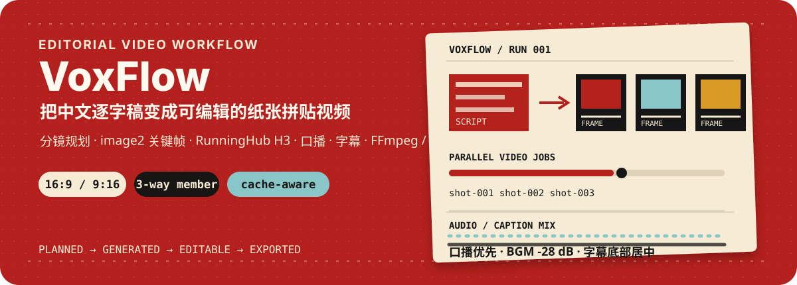
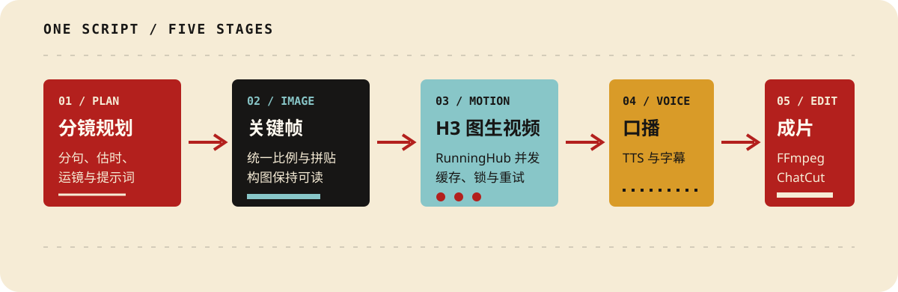

<p align="center">
  
</p>

<p align="center">
  <a href="https://github.com/shaomingchan/vox_video/actions/workflows/ci.yml"></a>
  <a href="https://github.com/shaomingchan/vox_video/blob/main/LICENSE"></a>
  <a href="https://www.python.org/"></a>
</p>

VoxFlow 是一套面向中文知识视频的自动化生产骨架：从逐字稿出发，规划分镜，生成纸张拼贴关键帧，调用 RunningHub MiniMax H3 图生视频，生成口播和字幕，再用 FFmpeg 或 ChatCut 输出成片。

它适合需要**反复制作解释型短视频**的创作者、研究者和自动化开发者。项目把最容易重复出错的部分固定下来：画面比例、提示词结构、缓存、并发锁、付费任务保护、混音和字幕位置。

## 先看它做什么

<p align="center">
  
</p>

<p align="center">
  
</p>

<p align="center"><sub>真实横屏成片画面：纸张拼贴构图、H3 镜头运动、口播混音与底部居中字幕。</sub></p>

| 输入 | 自动处理 | 输出 |
| --- | --- | --- |
| 一份中文逐字稿 | 分句、估时、分镜、提示词、缓存和并发任务 | 关键帧、分镜视频、口播、字幕、MP4、ChatCut handoff |

## 5 分钟试跑

### 1. 安装

```powershell
git clone https://github.com/shaomingchan/vox_video.git
Set-Location vox_video

py -3.11 -m venv .venv
.\.venv\Scripts\python.exe -m pip install --upgrade pip
.\.venv\Scripts\python.exe -m pip install -e .

Copy-Item config.example.toml config.local.toml
```

### 2. 配置

编辑 `config.local.toml`，填写外部适配器和 BGM 路径：

```toml
[paths]
whiteboard_root = "D:/path/to/whiteboard"
vox_director_root = "C:/Users/you/.codex/skills/vox-director"
projects_root = "projects"

[assembly]
bgm = "D:/path/to/background-music.mp3"
```

设置 RunningHub 会员 Key：

```powershell
$env:RUNNINGHUB_API_KEY = "<your-member-key>"
```

### 3. 先做免费检查和小样

```powershell
scripts/voxflow.ps1 doctor
scripts/voxflow.ps1 plan --project demo --script examples/demo-script.txt
scripts/voxflow.ps1 voice --project demo
scripts/voxflow.ps1 images --project demo
scripts/voxflow.ps1 videos --project demo --limit 3
scripts/voxflow.ps1 preview --project demo --limit 3
```

`--limit 3` 是有意的成本检查点：先看画面比例、运动、口播和字幕，再决定是否运行完整视频批次。

### 4. 完整运行

```powershell
scripts/voxflow.ps1 run `
  --project demo `
  --script examples/demo-script.txt
```

最终本地成片位于 `projects/demo/final/final_video.mp4`。

## 画面和声音规范

- 支持 `16:9` 横屏和 `9:16` 竖屏；图片、RunningHub 和合成画布使用同一比例
- 24 fps，H.264 / yuv420p，AAC 192 kbps
- 口播目标 `-16 LUFS`，真峰值上限 `-1.5 dBTP`
- BGM 默认 `-28 dB`
- 字幕默认画面下方居中，底边距约 `40 px`
- ChatCut 交接会静音图生视频素材原声，避免素材音轨压过口播

横屏配置示例：

```toml
[project]
aspect = "16:9"

[assembly]
width = 1920
height = 1080
```

竖屏配置示例：

```toml
[project]
aspect = "9:16"

[assembly]
width = 1080
height = 1920
```

## 服务与并发

### RunningHub 会员

```toml
[runninghub]
api_profile = "member"
instance_type = "default"
concurrency = 3
```

会员模式代码级上限为 3 路并发。

### RunningHub 企业共享

```powershell
$env:RUNNINGHUB_API_PROFILE = "enterprise"
$env:RUNNINGHUB_ENTERPRISE_API_KEY = "<your-enterprise-key>"
```

```toml
[runninghub]
api_profile = "enterprise"
enterprise_instance_type = "plus"
enterprise_concurrency = 100
```

企业模式会默认选择 Plus 机型，并把并发限制在 1 到 100 之间。100 路是服务上限，不等于每次都应该提交 100 个付费任务。

### Lite

```toml
[runninghub]
instance_type = "lite"
```

Lite 模式不发送 `instanceType`，交给 RunningHub 调度。

## 工作方式

### 分镜和提示词

`planner.py` 将中文逐字稿拆成 beat 和 shot，并为每个镜头生成：

- 一张宽景或细节关键帧提示词
- H3 I2VA 首帧引用说明
- 运镜幅度和速度
- 纸张层、胶带、阴影和停帧动作
- 画面内文字的稳定性约束

### 缓存和恢复

图片和视频根据提示词、画面比例、工作流 ID 和输入文件哈希建立指纹：

- 已成功的镜头不会重复付费生成
- 每个 RunningHub 任务完成后立即更新 manifest
- 同一项目使用 Windows Mutex 或 Unix 文件锁，避免两个终端重复提交
- `--force` 只在确认要重新生成时使用

### 付费任务保护

待生成镜头超过 `max_unconfirmed_batch` 时，流程会主动停止。优先使用：

```powershell
scripts/voxflow.ps1 videos --project demo --limit 3
scripts/voxflow.ps1 videos --project demo --shot-id 001 --shot-id 004
scripts/voxflow.ps1 videos --project demo --all
```

完整批次必须显式传入 `--all`，避免缓存异常或误操作造成大批量重复任务。

## ChatCut

生成可编辑交接文件：

```powershell
scripts/voxflow.ps1 chatcut --project demo
```

输出：

```text
projects/demo/final/chatcut_handoff.json
projects/demo/final/chatcut_prompt.txt
```

ChatCut 是可选编辑出口；即使没有 ChatCut，FFmpeg 本地合成仍可产出预览和最终 MP4。

## 当前适配边界

这个仓库已经可以复现当前生产环境，但仍有明确的外部依赖：

- image2 和 TTS 默认复用 whiteboard 项目的本地适配器
- RunningHub 节点映射对应配置中的工作流版本
- ChatCut 交接需要本机已登录并安装对应插件
- 当前主入口和验证环境以 Windows 为主；FFmpeg 和文件锁逻辑已为其他系统保留路径

如果你要把它部署给陌生用户，建议先完成 Provider 插件化、RunningHub 节点映射配置化和 ChatCut 权限收紧，再发布公开 Beta。

## 安全

真实 API Key 永远不进入仓库：

| 用途 | 环境变量 |
| --- | --- |
| 会员 Key | `RUNNINGHUB_API_KEY` |
| 企业 Key | `RUNNINGHUB_ENTERPRISE_API_KEY` |
| 企业 profile | `RUNNINGHUB_API_PROFILE`，值设为 `enterprise` |

`config.toml`、`config.local.toml`、`.env` 和生成目录均已忽略。

提交前运行：

```powershell
python scripts/check_secrets.py
```

扫描器只输出文件、行号和规则名称，不回显疑似凭据内容。发现密钥进入 Git 历史时，应立即在服务端撤销并重新生成。

详细处理规则见 [SECURITY.md](./SECURITY.md)。

## 项目目录

```text
vox_video/
  assets/readme/       README SVG 视觉资产
  examples/            可提交的示例逐字稿
  scripts/              PowerShell 入口与安全扫描
  src/voxflow/          分镜、适配器、RunningHub、合成和 ChatCut
  tests/                不调用付费 API 的单元测试
  config.example.toml   无密钥配置模板
  projects/             本地生成项目，不进入 Git
```

## 测试和 CI

本地：

```powershell
python -m unittest discover -s tests -v
python -m compileall -q src tests scripts
python scripts/check_secrets.py
```

GitHub Actions 会在 Windows runner 上执行安装、密钥扫描、Python 3.11 编译和测试。

## 参与开发

欢迎围绕这些方向提交 Issue 或 PR：

- 独立的 image / TTS / video Provider
- RunningHub 工作流 schema 和节点验证
- Linux / macOS 适配
- 完全免费的 mock demo
- 费用估算和 `voxflow status`
- 更强的字幕、响度和断点恢复测试

提交前请确认：

```powershell
python scripts/check_secrets.py
python -m unittest discover -s tests -v
git diff --check
```

## 许可证

本项目使用 Apache-2.0 许可证，详见 [LICENSE](./LICENSE)。第三方服务、模型、字体、音乐和外部插件仍受各自条款约束。
